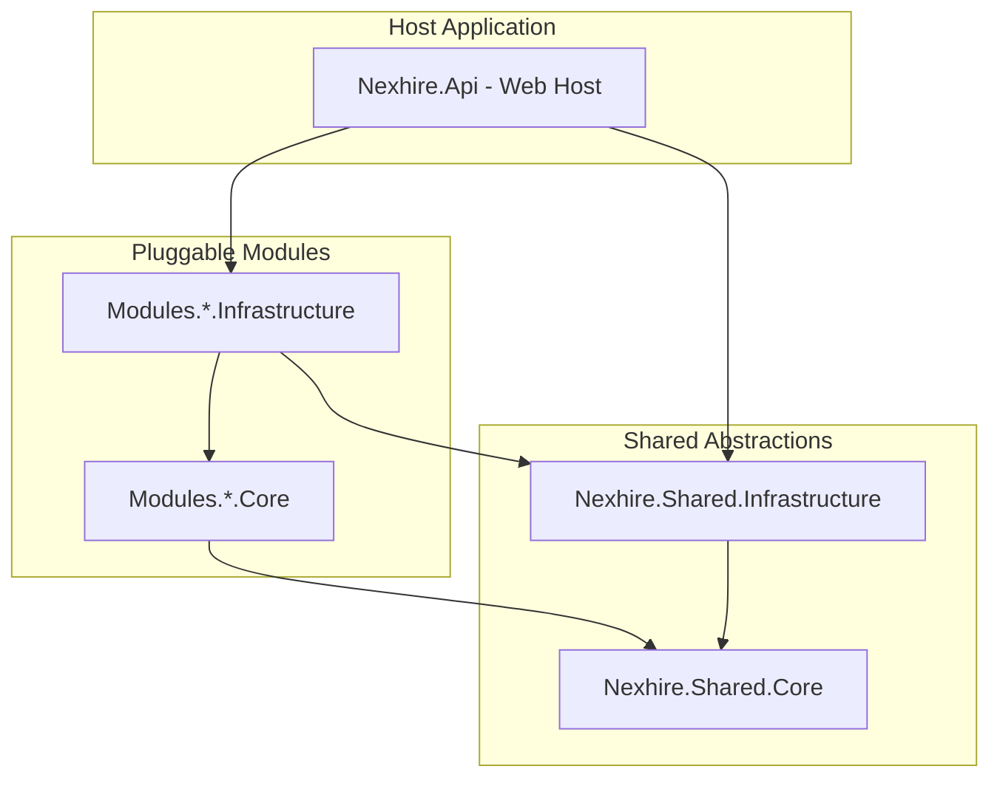

# Nexhire Core

Core backend for **NexHire** — a premium modular monolith API designed around Domain-Driven Design (DDD), CQRS, and Clean Architecture principles, targeting **.NET 10.0**.

---

## 🏛️ System Architecture

Nexhire is structured as a **Modular Monolith**, ensuring a strict boundary between feature areas (modules) while deploying as a single unified service. This achieves the scalability and domain isolation of microservices with the deployment simplicity of a monolith.



### Key Architectural Guidelines
1. **Pristine Domain Layer**: The Domain Layer (`.Core`) has **zero** outer-layer references. Database entities, validation schemas, and business rules are completely independent of hosting and database frameworks.
2. **Dynamic Wiring**: Pluggable modules (like `Users`) are registered inside the Host's `Program.cs` via compile-safe, explicit assembly scans and extension methods (e.g., `builder.Services.AddUsersModule(...)` and `app.MapUsersEndpoints()`).
3. **CQRS Command-Query Separation**: Commands (state mutations) and Queries (data retrieval) are strictly separated. We use **MediatR** as an in-memory mediator to dispatch actions.
4. **Monadic Error Handling**: Rather than throwing expensive business exceptions, all operations return a unified `Result` or `Result<T>` monad containing detailed failure `Error` structures.
5. **Atomic Domain Events**: Aggregate Roots capture events inline. They are dispatched asynchronously by our custom EF Core `PublishDomainEventsInterceptor` inside the database transaction boundary, enforcing atomicity.

---

## 📂 Project Directory Structure

```text
/
├── Nexhire.slnx               # Unified XML-based .NET 10 solution configuration
├── docker-compose.yml         # Container orchestration (API + PostgreSQL)
├── docs/                      # Technical architectural designs
├── scripts/                   # Migration & helper shell scripts
├── tools/                     # Code-gen & SDK generators
├── vault/                     # Certificates and secrets vault
├── src/
│   ├── Host/
│   │   └── Nexhire.Api/       # ASP.NET Core API Web Host
│   ├── Shared/
│   │   ├── Nexhire.Shared.Core/           # Core DDD / CQRS interfaces and result types
│   │   └── Nexhire.Shared.Infrastructure/  # Pipeline behaviors, Db interceptors, OpenAPI/Scalar
│   └── Modules/               # Pluggable Feature Modules
│       ├── AdministratorsConfiguration/
│       ├── ContentManagement/
│       ├── EmployerProfiles/
│       ├── ExternalJobSync/
│       ├── IdentityAccess/
│       ├── JobApplication/
│       ├── JobPostings/
│       ├── JobSeekerProfile/
│       ├── Notification/
│       ├── RecommendationEngine/
│       ├── Reporting/
│       ├── SearchDiscovery/
│       └── Users/
│           ├── Nexhire.Modules.*.Core/           # Domain aggregates & application logic
│           └── Nexhire.Modules.*.Infrastructure/ # EF Core persistence, API endpoints
└── tests/
    ├── Nexhire.ArchitectureTests/                    # Compile-time dependency boundary checks
    └── Modules/                                      # Test suites for each module
        └── */
            ├── Nexhire.Modules.*.Tests.Unit/         # Unit test suite for CQRS business rules
            └── Nexhire.Modules.*.Tests.Integration/  # Integration test suite
```

---

## 🛠️ Technology Stack

* **Runtime & Framework**: .NET 10.0 SDK, C# 14
* **API Documentation**: Native .NET 10 OpenAPI document generation mapped onto the dark-themed **Scalar API Explorer** (`/scalar/v1`) with built-in client SDK generators.
* **Database & ORM**: **PostgreSQL** running on **EF Core 10** with dedicated Postgres schema segregation per module.
* **CQRS Dispatcher**: **MediatR**
* **Validation Engine**: **FluentValidation** integrated directly into the MediatR request pipeline.
* **Testing Stack**: **xUnit**, **NSubstitute** (mocking), **FluentAssertions**, and **NetArchTest.Rules** (architectural rules checking).

---

## 🚀 Getting Started

### Prerequisites
* [.NET 10.0 SDK](https://dotnet.microsoft.com/download/dotnet/10.0)
* [Docker Desktop](https://www.docker.com/products/docker-desktop/)

### 1. Run the Complete Infrastructure
To build and spin up the complete environment (PostgreSQL database container + Web API host container), execute:
```bash
docker compose up -d --build
```
Once spun up, open [http://localhost:5001/scalar/v1](http://localhost:5001/scalar/v1) to access the interactive visual API documentation dashboard.

### 2. Run Locally in Development Mode
If you prefer running the application outside of Docker:
1. Start PostgreSQL (e.g., via `docker compose up -d nexhire-db`).
2. Boot the API host:
   ```bash
   dotnet run --project src/Host/Nexhire.Api
   ```
3. The API will start up on `http://localhost:5001`. Browse to [http://localhost:5001/scalar/v1](http://localhost:5001/scalar/v1) for developer documentation.

### 3. Run the Verification Tests
To run both the architectural compliance tests and unit tests:
```bash
dotnet test
```
