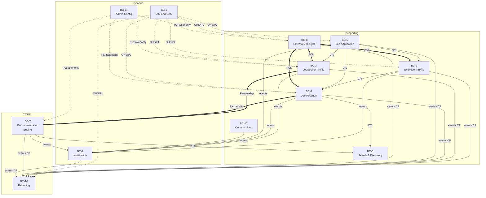
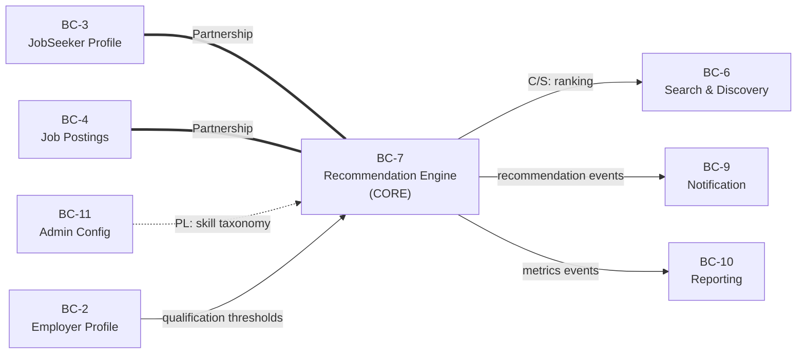
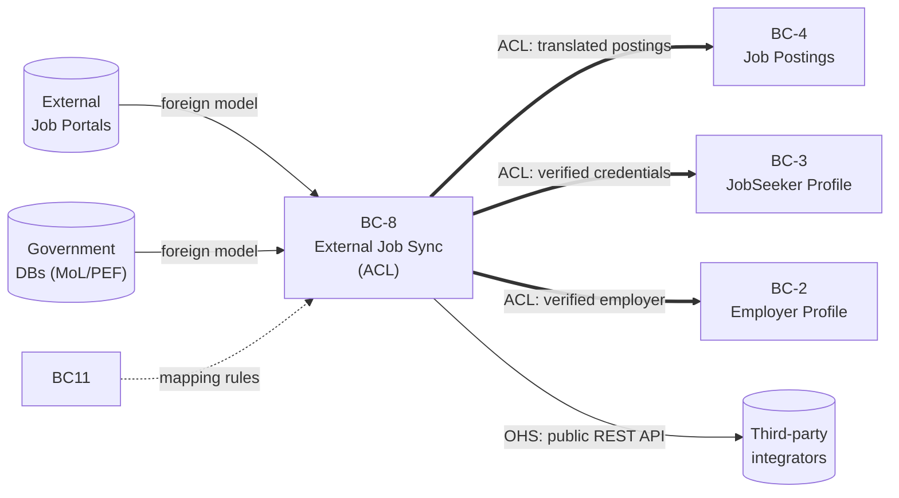
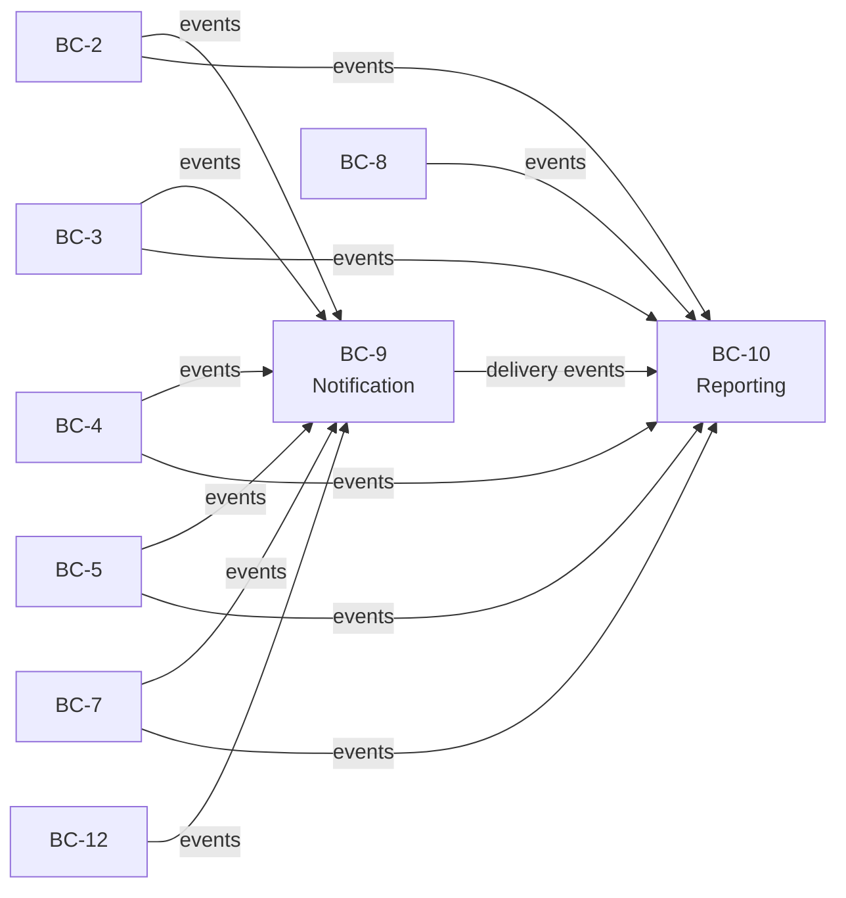

# Context Map

A **context map** is the strategic-design artifact that shows how the platform's bounded contexts relate to each other — who depends on whom, who translates what, and where models cross boundaries.

This document complements [[BC_Mapping]]: that file shows *which stories live in which BC*; this file shows *how the BCs talk to each other*.

## Subdomain classification

| BC | Name | Class | Why |
|---|---|---|---|
| BC-1 | IAM and UAM | generic | Identity is solved problem; no competitive differentiation. |
| BC-2 | Employer Profile Management | supporting | Important but not the differentiator. |
| BC-3 | JobSeeker Profile | supporting | Same — the data fuels the core, but isn't itself the core. |
| BC-4 | Job Postings | supporting | A job-board feature; table-stakes. |
| BC-5 | Job Application | supporting | Necessary for the funnel, but conventional. |
| BC-6 | Search & Discovery | supporting | Standard search; differentiation lives in BC-7. |
| BC-7 | **Recommendation Engine** | **CORE** | The AI matching is the platform's reason for existing. |
| BC-8 | External Job Synchronization | supporting (ACL) | Necessary plumbing to other systems. |
| BC-9 | Notification | generic | Send-an-email is a generic capability. |
| BC-10 | **Reporting** | **CORE** (for LMIS) | LMIS analytics is the *other* differentiating outcome. |
| BC-11 | Administrators Configuration | generic | System config is generic. |
| BC-12 | Content Management | supporting | News/FAQ — standard CMS-shaped work. |

Two cores. Everything else exists to feed them or to make the platform usable.

## Pattern legend

DDD strategic-design patterns used below:

- **OHS** — Open Host Service: upstream publishes a stable API many downstreams consume.
- **PL** — Published Language: a formal, shared model at the boundary (e.g. JSON schema, event contract, taxonomy).
- **ACL** — Anti-Corruption Layer: downstream wraps an upstream it doesn't trust/control, translating into its own model.
- **CF** — Conformist: downstream accepts the upstream's model as-is, without translating.
- **C/S** — Customer/Supplier: downstream's needs influence upstream's roadmap; both sides negotiate the contract.
- **P** — Partnership: two contexts succeed or fail together; tightly coordinated evolution.
- **SK** — Shared Kernel: two contexts share a small common model — powerful but risky, requires synchronized changes.

The arrow direction in the diagrams is **upstream → downstream** (information flows the same direction; the downstream depends on the upstream).

## Overview map

**Reading the map:**

- **Dotted arrows** are platform-wide infrastructure flows (auth tokens from BC-1, taxonomy from BC-11). These cross *every* domain BC; we draw them dotted to keep the picture readable.
- **Solid arrows** are domain dependencies between business contexts.
- **Thick `==>` arrows** highlight Anti-Corruption Layer boundaries — places where a foreign model would corrupt our domain if we didn't translate it.
- **Equals lines `===`** mark Partnership relationships — the two BCs must change in lockstep.

## Focused view: the CORE (Recommendation Engine)

The CORE has Partnership relationships with both profile contexts and Job Postings — they evolve together because the matching algorithm's quality depends on what these contexts choose to model. The taxonomy from BC-11 enters as Published Language; if BC-11 changes the skill ontology, BC-7 must adapt.

## Focused view: integration boundary (External Job Sync)

BC-8 plays two strategic roles at once: it's an **ACL** for everything coming *in* from external systems, and an **OHS** for everything going *out* via the public API. This is the BC where students should spend the most time understanding why a translation layer matters.

## Focused view: read-models (Notification & Reporting)

Both BC-9 and BC-10 are **Conformist consumers** — they subscribe to whatever events the upstream BCs emit and don't get to dictate the shape. The upstream contracts are **Published Language** (a versioned event schema). This is a textbook CQRS / event-driven read-model pattern.

## Full relationship table

| Upstream | Downstream | Pattern | What flows | Notes |
|---|---|---|---|---|
| BC-1 IAM/UAM | BC-2, BC-3, BC-4, BC-5, BC-7, BC-8, BC-10, BC-12 | OHS + PL | Identity tokens, role claims | Every BC consumes auth via the same JWT/OAuth contract. |
| BC-11 Admin Config | BC-3, BC-4, BC-7, BC-8 | PL (taxonomy) | Skills, occupations, industries vocabulary | Candidate for **Shared Kernel** if the taxonomy ends up tightly coupled to multiple contexts. |
| BC-2 Employer Profile | BC-4 Job Postings | C/S | Verified employer identity | A posting requires a verified employer; the contract is negotiated. |
| BC-2 Employer Profile | BC-7 Recommendation | C/S | Qualification thresholds, preferences | Employer config tunes matching. |
| BC-3 JobSeeker Profile | BC-7 Recommendation | **Partnership** | Profile, parsed resume, skills | Tight coupling — profile schema *is* a matching input. |
| BC-4 Job Postings | BC-7 Recommendation | **Partnership** | Posting content, requirements | Posting schema *is* the other matching input. |
| BC-4 Job Postings | BC-6 Search & Discovery | C/S | Indexed posting documents | Search owns its read model; postings stream into the index. |
| BC-7 Recommendation | BC-6 Search & Discovery | C/S | Ranking / relevance scores | Search blends keyword match with recommendation signals. |
| BC-5 Job Application | BC-2, BC-3, BC-4 | C/S | Application snapshot | Application reads from all three at the moment of submit. |
| BC-8 External Sync | BC-4 Job Postings | **ACL** | Translated foreign postings | Foreign job formats normalized to internal posting model. |
| BC-8 External Sync | BC-3 JobSeeker Profile | **ACL** | Verified credentials, identity | Government data wrapped before entering Profile aggregate. |
| BC-8 External Sync | BC-2 Employer Profile | **ACL** | Government-verified employer status | Same — gov registry wrapped to local model. |
| BC-12 Content Mgmt | BC-3 JobSeeker (dashboard) | C/S | Personalized news / help content | Content surfaced in dashboard. |
| All domain BCs | BC-9 Notification | CF | Domain events (subscription) | Notification adapts to whatever events upstream emits. |
| All domain BCs | BC-10 Reporting | CF | Domain events (subscription) | Same; Reporting also consumes Notification's delivery events. |

## Key insights for the course

**1. Two cores, not one.** AI matching (BC-7) and LMIS reporting (BC-10) are both core. This is realistic — most platforms have multiple core subdomains. Useful debate: *if you had to invest in only one, which one and why?*

**2. The Partnership relationships are where modeling pain will live.** BC-3↔BC-7 and BC-4↔BC-7 cannot evolve independently. Worth contrasting with the Customer/Supplier relationship between BC-4 and BC-6 — Search can adapt to Postings on its own schedule.

**3. ACL is concentrated in BC-8.** All three ACLs (toward Job Postings, JobSeeker Profile, Employer Profile) are inside BC-8's translation layer. This is a clean pedagogical example of *why* you isolate foreign models behind an ACL — without it, gov-data field naming would leak into Employer Profile and corrupt its ubiquitous language.

**4. BC-1 (IAM) and BC-11 (Taxonomy) are platform-wide infrastructure.** Both are Open Host Services / Published Languages used by nearly every domain BC. In implementation, both would be deployed as small services with strict, versioned contracts.

**5. Notification and Reporting are downstream of *everything*.** They don't dictate; they subscribe. This is the CQRS / event-driven pattern in microcosm. Useful to ask: *what happens if we couple Reporting too tightly to a specific upstream — say, Job Postings?* (Answer: Reporting becomes a bottleneck for Posting schema changes.)

**6. BC-11 (Admin Config) is intentionally thin** — see [[BC_Mapping]] anomalies. It exists because taxonomies are used across many BCs and need a single owner. A useful class question: *should BC-11 be a Shared Kernel with BC-3/BC-4/BC-7/BC-8 instead of a Published Language?*

## Open questions for class discussion

1. **Should BC-3 (JobSeeker Profile) own resume parsing, or should BC-7 (Recommendation Engine) own it?** Currently the parsed-resume stories live in BC-3 with BC-7 as collaborator. Trade-offs: ownership clarity vs. coupling to ML pipeline.

2. **Is the BC-8 ACL too broad?** It covers partner job sync, government verification, and the public outbound API. Could be three BCs. What's the cost of splitting? What's the cost of keeping them merged?

3. **Should BC-9 (Notification) own user notification preferences, or should each profile BC own its own preferences?** Right now preferences live in BC-9. This is a choice with downstream consequences.

4. **Where does the AccountDeactivationCascade saga live?** No BC owns it explicitly today. Is the saga a 13th context (a "process manager"), or does it belong to BC-1?

## Method note

Patterns assigned by inspecting the dominant integration mode for each BC pair: which BC controls the contract, who has to translate, and how tightly their schedules are coupled. Where multiple patterns could apply, the choice favors the one that best illustrates strategic-design trade-offs for a teaching context — not necessarily the one a production team would ship first.

Refresh whenever a BC is added/removed or a relationship shifts (e.g., what was Customer/Supplier becomes Partnership as coupling deepens).
